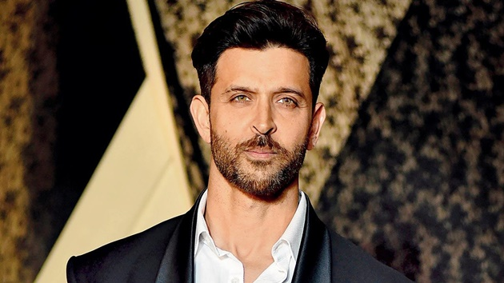
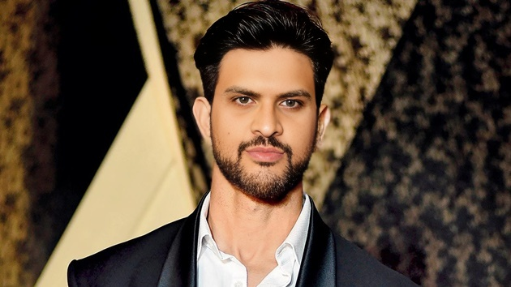

# openMediaTool

Following operations are supported
1. Convert video to required format
2. Resize the video file
3. Enhance video to good quality
4. Create video from a series of Images
5. Create gif from Images
6. A simple video player with basic interface
7. Extract all frames from the video
8. Change the video fps (Reduce the video size in case of lower fps and insert more black frames in case of higher fps)
9. Enhance Image with faces
10. Swap faces in image with enhancement (cd coreLib,  python .\imageSwapAndEnhance.py (in the file change the image directory location) )

## IMAGE SWAP FACE DEMO

